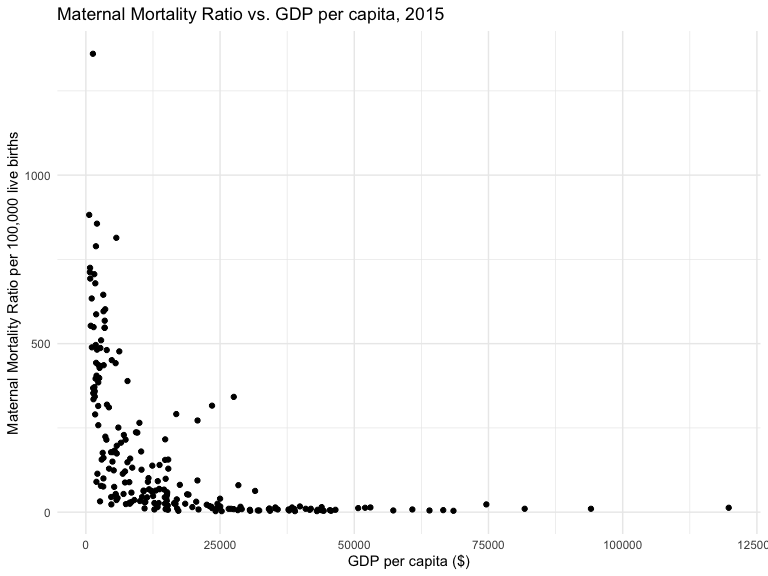
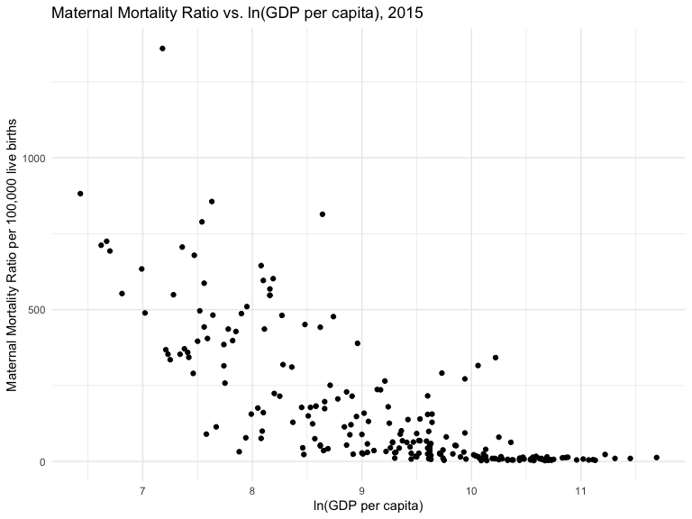

Dataset\_Mortality per GDP capita
================
Duzhi Zhao
11/17/2019

## Import dataset

``` r
# Maternal Mortality Ratio: number of maternal deaths during a given time period per 100,000 live births during the same time period.
# MMR measures the obsteric risk a women is facing when she is pregnant. 
# E.g. 1575 per 100,000 live births (Afghanistan) vs. 5 per 100,000 live births (Sweden) means a women in Afghanistan is facing a 315 times higher risk of maternal death when she is pregnant than a woman in Swedan. 
mmr_gdp_capita = read_csv("./data/maternal-mortality-ratio-vs-gdp-per-capita.csv") %>%
  janitor::clean_names() %>% 
  rename(
    country = entity,
    mmr = maternal_mortality_ratio_deaths_per_100_000_live_births,
    gdp_per_capita = gdp_per_capita_international,
    gdp = x6) %>% 
  mutate(
    country = as.factor(country),
    code = as.factor(code)
  ) %>% 
  mutate(
    gdp_per_capita = round(gdp_per_capita, digits = 2)
  ) %>% 
  filter(year > 2000, year < 2016)

summary(is.na(mmr_gdp_capita$mmr)) # 945 NA, 3435 non-NA
```

    ##    Mode   FALSE    TRUE 
    ## logical    3435     945

``` r
summary(is.na(mmr_gdp_capita$gdp_per_capita)) # 845 NA, 3535 non-NA
```

    ##    Mode   FALSE    TRUE 
    ## logical    3535     845

``` r
summary(is.na(mmr_gdp_capita$gdp)) # 750 NA, 3630 non-NA
```

    ##    Mode   FALSE    TRUE 
    ## logical    3630     750

## log-transformed ‘gdp\_per\_capita’

``` r
# log-transformed
mmr_gdp_capita_log = 
  mmr_gdp_capita %>% 
  mutate(
    ln_gdp_per_capita = round(log(gdp_per_capita), digits = 2)
  )
```

## ggplot (year = 2015): linear + log

``` r
mmr_gdp_capita_log %>% 
  filter(year == 2015) %>% 
  ggplot(aes(x = gdp_per_capita, y = mmr)) + 
  geom_point() +
  labs(x = "GDP per capita ($)",
       y = "Maternal Mortality Ratio per 100,000 live births",
       title = "Maternal Mortality Ratio vs. GDP per capita, 2015")
```



``` r
mmr_gdp_capita_log %>% 
  filter(year == 2015) %>% 
  ggplot(aes(x = ln_gdp_per_capita, y = mmr)) + 
  geom_point() +
  labs(x = "ln(GDP per capita)",
       y = "Maternal Mortality Ratio per 100,000 live births",
       title = "Maternal Mortality Ratio vs. ln(GDP per capita), 2015")
```


