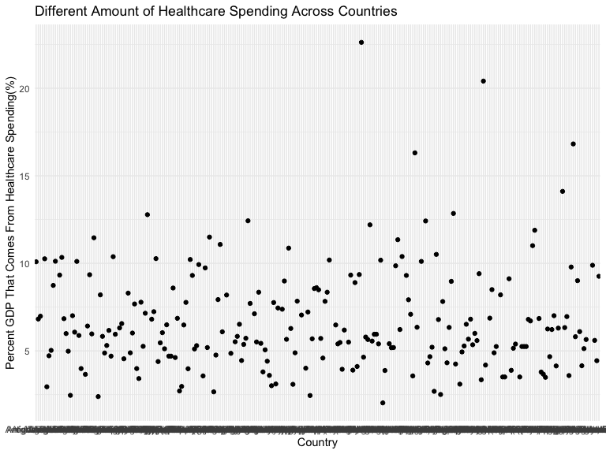
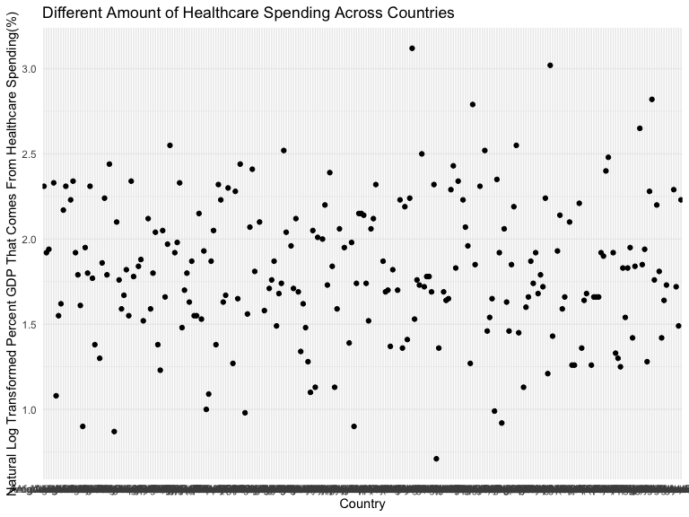

healthcare\_spending\_data\_cleaning
================
Michael Yan
11/16/2019

# general setup

# import and clean data

``` r
# Percent GDP that comes from health spending
health_spending_percent_gdp = read_csv("./data/WorldBank/health_spending_percent_GDP.csv") %>%
  janitor::clean_names() %>% 
  select(country_name, country_code, x2000:x2016) %>% 
  pivot_longer(
  x2000:x2016,
  names_to = "year",
  values_to = "health_spending_percent_GDP") %>% 
  mutate(year = str_remove(year,"x")) %>% 
  mutate(health_spending_percent_GDP = round(health_spending_percent_GDP, digits = 2)) %>% 
  mutate(country_name = as.factor(country_name),
         country_code = as.factor(country_code))
```

    ## Parsed with column specification:
    ## cols(
    ##   .default = col_logical(),
    ##   `Country Name` = col_character(),
    ##   `Country Code` = col_character(),
    ##   `Indicator Name` = col_character(),
    ##   `Indicator Code` = col_character(),
    ##   `2000` = col_double(),
    ##   `2001` = col_double(),
    ##   `2002` = col_double(),
    ##   `2003` = col_double(),
    ##   `2004` = col_double(),
    ##   `2005` = col_double(),
    ##   `2006` = col_double(),
    ##   `2007` = col_double(),
    ##   `2008` = col_double(),
    ##   `2009` = col_double(),
    ##   `2010` = col_double(),
    ##   `2011` = col_double(),
    ##   `2012` = col_double(),
    ##   `2013` = col_double(),
    ##   `2014` = col_double(),
    ##   `2015` = col_double()
    ##   # ... with 1 more columns
    ## )

    ## See spec(...) for full column specifications.

# plot a scatter plot, country on the x axis, percent GDP spend on healthcare on the y axis

``` r
latest_health_spending_scatter = 
  health_spending_percent_gdp %>% 
  ggplot(aes(x = country_name, y = health_spending_percent_GDP)) + 
  geom_point()
```

# log-transformed ‘health\_spending\_percent\_GDP’

``` r
# log-transformed
health_spending_percent_GDP_log = 
  health_spending_percent_gdp %>% 
  mutate(
    ln_health_spending = round(log(health_spending_percent_GDP), digits = 2)
  )
```

``` r
## ggplot (year = 2015): linear + log
health_spending_percent_GDP_log %>% 
  filter(year == 2015) %>% 
  ggplot(aes(x = country_name, y = health_spending_percent_GDP)) + 
  geom_point() +
  labs(x = "Country",
       y = "Percent GDP That Comes From Healthcare Spending(%)",
       title = "Different Amount of Healthcare Spending Across Countries")
```



``` r
health_spending_percent_GDP_log %>% 
  filter(year == 2015) %>% 
  ggplot(aes(x = country_name, y = ln_health_spending)) + 
  geom_point() +
  labs(x = "Country",
       y = "Natural Log Transformed Percent GDP That Comes From Healthcare Spending(%)",
       title = "Different Amount of Healthcare Spending Across Countries")
```


